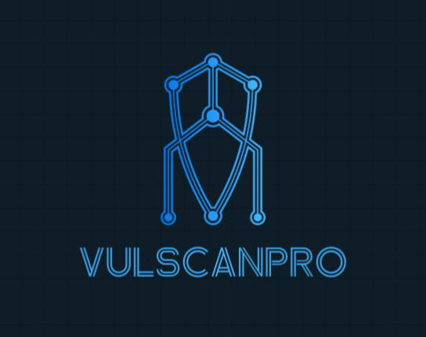
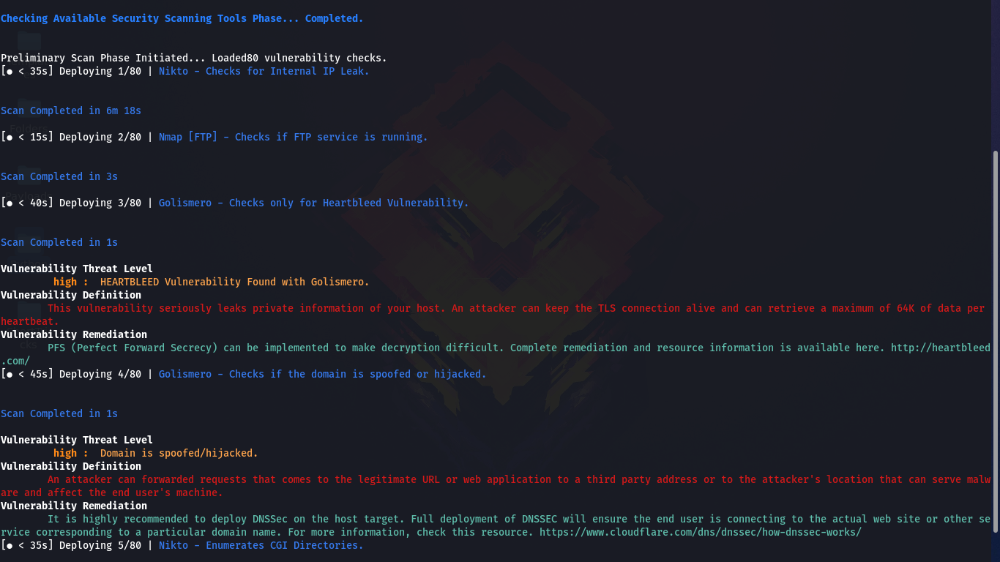
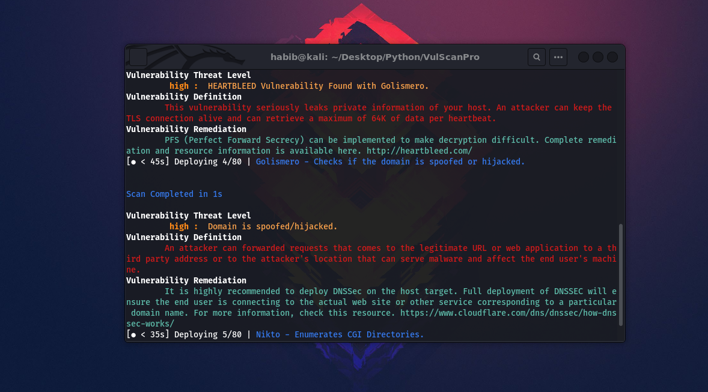

<h1 align="center">
  <br>
  <a href="https://github.com/thenurhabib/vulscanpro"></a>
  <br>
  VulScanPro
  <br>
</h1>

<h4 align="center">Automatic Web Vulnerability Scanner</h4>

<p align="center">
  <a href="https://github.com/thenurhabib/vulscanpro/releases">
    
  </a>
 
  <a href="https://github.com/thenurhabib/vulscanpro/issues?q=is%3Aissue+is%3Aclosed">
      
  </a>
  
  <a href="https://github.com/thenurhabib/vulscanpro/blob/main/LICENSE">
      
  </a>
  

</p>



<br>

```bash

          
 __      __    _  _____                 _____           
 \ \    / /   | |/ ____|               |  __ \  1.0.0        
  \ \  / /   _| | (___   ___ __ _ _ __ | |__) | __ ___  
   \ \/ / | | | |\___ \ / __/ _` | '_ \|  ___/ '__/ _ \ 
    \  /| |_| | |____) | (_| (_| | | | | |   | | | (_) |
     \/  \__,_|_|_____/ \___\__,_|_| |_|_|   |_|  \___/ 
     
     Automatic Web Vulnerability Scanner.

                          by ＠ｔｈｅｎｕｒｈａｂｉｂ
```

<br>


VulScanPro is An Intelligent Automated Framework to scan a domain and perform various attacks to find vulnerabilities. VulScanPro performs 100+ attacks with mutiple web hacking and networking analyzing frameworks. and also it's provide you discription about that vulnerbitry and solution also.


### Find for This vulnerabilities
- Cross Site Scripting (XSS)
- SQL Injection 
- Open Redirection
- Server-side request forgery (SSRF)
- Cross-site request forgery (CSRF)
- Cross-origin resource sharing (CORS)
- Host Heder Injection
- HTML Injection
- Session Hijacking
- Subdomain Takeover
- Sensitive Information disclosure
- shell injection
- clickjacking
- Remote Code execution
- path traversal
- Broken Access Control
- Security Misconfiguration
- Vulnerable and Outdated Components
- Unrestricted File Upload

`This Framework Also crawl URLs and JS Files for sensitive information.`

<br>

### Installation

```bash
git clone https://www.github.com/thenurhabib/vulscanpro
cd vulscanpro
pip install -r requirements.txt
python3 vulscanpro.py -h
```
<br>

#### Usage
```bash
>> python3 vulscanpro.py example.com              (Scan Domain)
>> python3 vulscanpro.py example.com --skip       (Skip some tools and scan faster.)
>> python3 vulscanpro.py example.com --nospinner  (Disable the IDLE spinner.)
```


#### Available command line options
```bash
Usage : 

>> python vulscanpro example.com

-h, --help           : Help Menu
-s, --skip           : Skip some tools and scan faster.
-u, --update         : Update VulScanPro.
-n, --nospinner      : Disable the IDLE spinner.
```

<hr>

#### Domain hijacking vulnerability in Yahoo



<br>

### :warning: Warning!

***I Am Not Responsible of any Illegal Use***

-------------------------------------

### _🕷️ Contribution & License_

You can contribute in following ways:

- [Report bugs & add issues](https://github.com/thenurhabib/vulscanpro/issues/new)
- Search for new vulnerability
- Develop plugins
- Searching Exploits
- Give suggestions **(Ideas)** to make it better

Do you want to have a conversation in private? email me : thenurhabib@gmail.com

***VulScanPro*** is licensed under [GPL-3.0 License](https://github.com/thenurhabib/vulscanpro/blob/master/LICENSE)
